# LR6
## Лабораторная работа №6

**Цель работы:** изучение базовых возможностей системы управления версиями, опыт работы с Git Api,
опыт работы с локальным и удалённым репозиторием.

**Ход работы**

1. Создан аккаунт на сайте GitHub
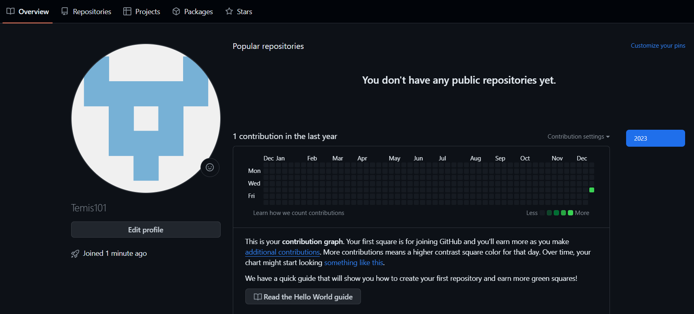

2. Создана копия исходного репозитория в личное хранилище
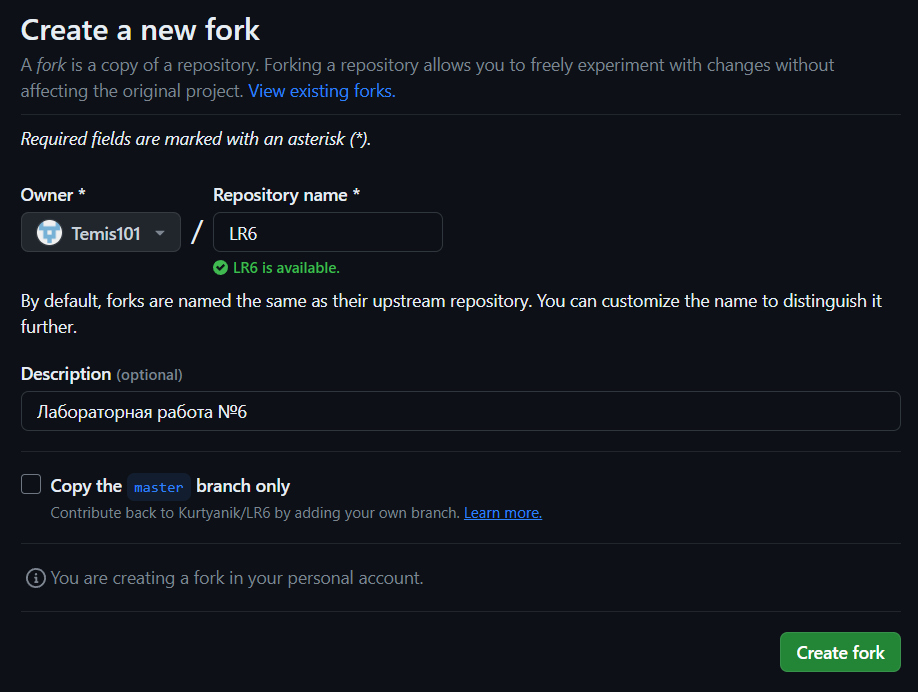

3. Настроен клиент Git (введено имя пользователя и email) с помощью команд `git config --globaluser.name <имя>` и `git config --global user.email <email>`
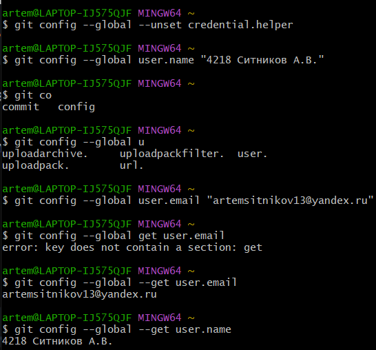

4. Клонирован личный удалённые репозиторий на компьютер при помощи `git clone`
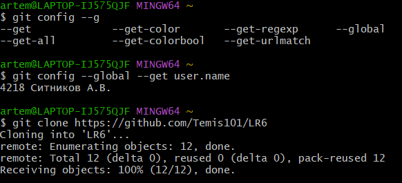

5. Добавлен файл через интерфейс GitHub 
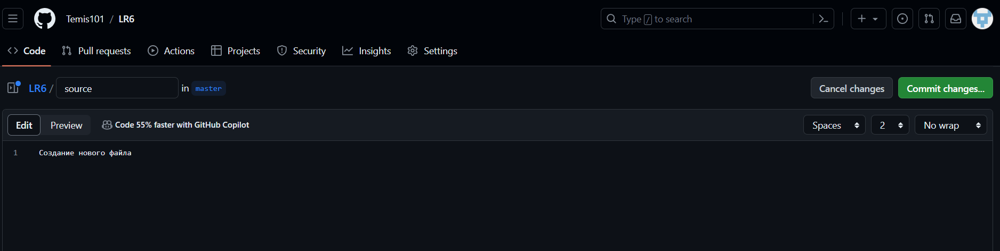

Изменения подтянуты в локальный репозиторий (переход в локальный репозиторий - `cd LR6`,
подтягивание - `git pull`)
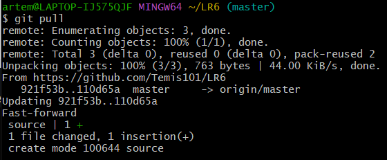

> Далее работа продолжена локально
6. Получена история операций веток с помощью `git log`
для **master**
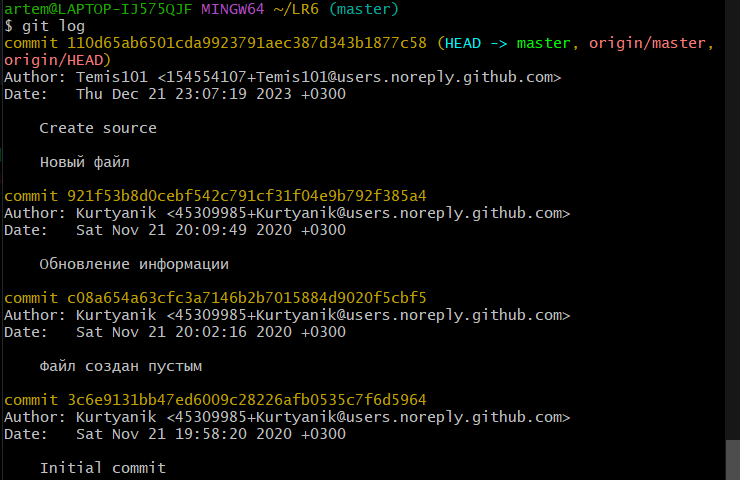

для **branch1**
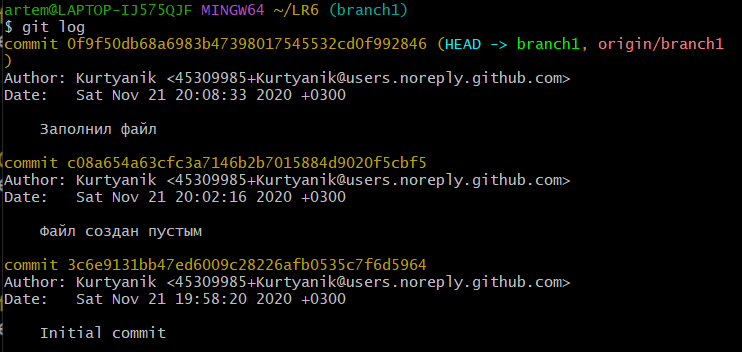

7. Просмотрены последние изменения ветки master с помощью `git log --all --graph --oneline`
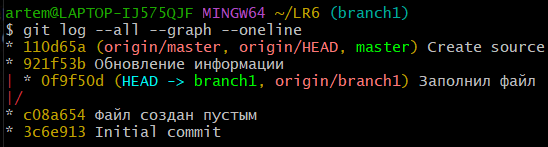

8. Выполнено слияние веток при помощи `git merge branch1`, просмотрено состояние проекта с использованием
`git status` и разрешён конфликт по данной ситуации `git add <file>`
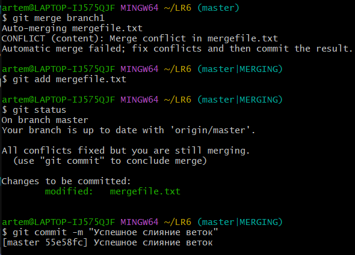

9. Удаление побочной ветки после слияния с помощью `git branch -d <ветка>`
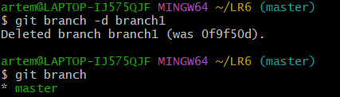

10. Проведены и зафиксированы изменения

Первое изменение
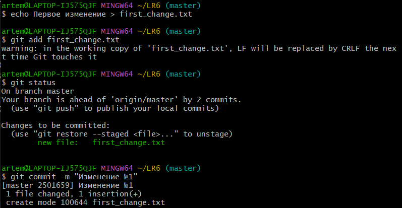
 
Второе изменение
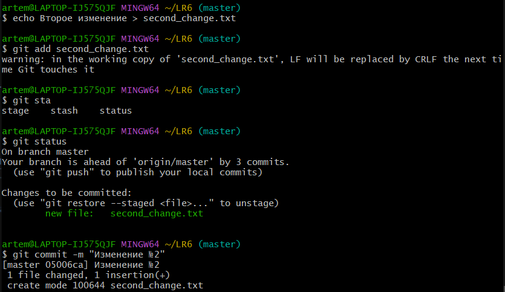

Просмотр историй операций с помощью `git log -2`
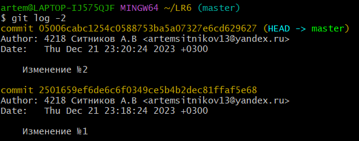

11. Сделан откат коммита с помощью `git reset HEAD~1` и проверена история изменений
с помощью `git log -2`
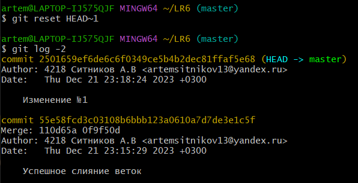

12. Создана ветка для отчёта branch2 с помощью `git branch branch2`
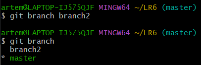

13. Оформление отчёта
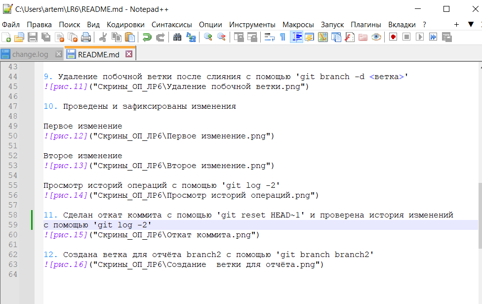

14. История всех операций в форматированном виде
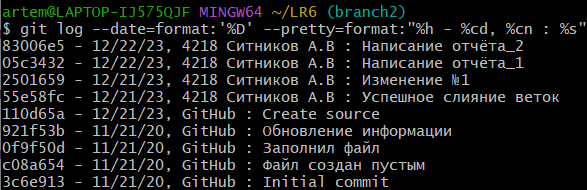

**Лог всех команд:**
git config - настройки
git clone - клонирование репозитория
git pull - извлечение и загрузка содержимого из удаленного репозитория
git log --all --graph --oneline - вывод компактного графа истории коммитов
git checkout - переключениt между ветками
git log -p -2 - просмотр историй коммитов с показом изменений, внесенных в каждом коммите
git merge - объединение изменений из одной ветки в другую
git status - показывает состояния файлов в рабочем каталоге
git add - добавление изменений в индекс
git commit -m Text - делает для проекта снимок текущего состояния изменений, добавленных в раздел проиндексированных файлов
git branch -d - удаление ветки
git log --date=format:'%D' --pretty=format:%h - %cd, %cn : %s - вывод истории коммитов с форматированными данными

**Вывод:** в ходе лабораторной работы были изучены базовые возможности системы управления версиями, также был получен опыт работы с Git Api и опыт работы с локальным и удаленным репозиторием.